# SDK接口文档

| **版本** | **日期**   | **备注**                                                     |
| -------- | ---------- | ------------------------------------------------------------ |
| 1.0      | 2021/07/20 | 初稿形成                                                     |
| 1.1      | 2021/08/10 | 将json数据结尾改成@*@@@                                      |
| 1.2      | 2021/08/12 | 增加心率、电量告警传输json                                   |
| 1.3      | 2021/08/31 | 增加蓝牙网关地图标记坐标，以及增加地图配置界面               |
| 1.4      | 2022/01/18 | 规范网关命令规范，以及增加G类型网关管理                      |
| 1.5      | 2022/02/17 | 新增平面地图电子围栏（4.12章节），更改地图配置界面图片       |
| 1.6      | 2022/08/16 | 新增4.14历史轨迹查询；4.15个人实时定位数据查询，5.3规范告警数据格式 |
| 1.6.1    | 2022/09/28 | 新增2.3.刷新token；                                          |
| 1.6.2    | 2022/09/30 | 新增5.3.6网关离线告警                                        |
| 1.6.3    | 2022/11/02 | 新增3.4和4.16声光报警灯的管理已经预警                        |
| 1.6.4    | 2023/03/01 | 新增4.17室温和4.18物质标签界面，以及删除R9不必要的字段，以及更改环境温度temperatureEnv位temperatureEnvn |

**致开发者：**

1. 若需要硬件请联系销售人员,  https://www.imyfit.com
2. 本PDF协议文档可能不是最新版本
3. 若协议有更新，不再另行通知，强烈建议开发者到 https://imyfit.gitee.io 获取最新协议
4. 若对协议不理解或发现协议有bug请到issues区域提出（或者提交一个 pull request），愿我们的付出对您的开发事半功倍。

## 1. 简介

### 1.1.概述

​	该文档适用于乙方直接购买我司终端产品，且需要我司协助做室内外地图定位展示的，直接对接该接口文档，即可拥有自己的室内外地图引擎展示。

​	该系统即可独立部署，展示实时定位使用，也可以用户根据自己的业务需求，将系统通过导航栏的方式嵌入到自己的业务系统中，结合自己的业务完善定位需求。 

### 1.2.安装环境

​	服务器环境需要：jdk1.8，缓存数据库：redis3.6+，数据库mysql8.0，mqtt中间件mosquitto（安装2.0以下）

## 2.用户接口

​	该接口适用于，客户自己根据自己的业务需求登录注册使用的。

### 2.1.用户注册

| 描述     | 备注                                                         |
| -------- | ------------------------------------------------------------ |
| 请求URL  | ${http://ip:port}/register                                   |
| 请求方式 | POST                                                         |
| 请求数据 | {  "userName":"用户名",  "password":"密码"  }                |
| 返回成功 | {  "code":2000,  "message":"注册成功",  "data":"token信息"  } |
| 返回失败 | {  "code":"数字大于2000为别的含义",  "message":"具体失败的信息",  "data":null  } |

**注：**

​	1.该接口，提供用户自己的注册属于自己的账号，也在放置在业务系统的注册中，先在业务系统注册成功后，再请求该接口进行注册用户，以保证两边用户表的数据是相同的。

### 2.2.用户登录

| 描述     | 备注                                                         |
| -------- | ------------------------------------------------------------ |
| 请求URL  | ${http://ip:port}/login                                      |
| 请求方式 | POST                                                         |
| 请求数据 | {  "userName":"用户名",  "password":"密码"  }                |
| 返回成功 | {  "code":2000,  "message":"登陆成功",  "data":"返回一个token"  } |
| 返回失败 | {  "code":"数字大于2000为别的含义",  "message":"具体失败的信息",  "data":null  } |

**注：**

​	1.单独使用的时候，自己输入url登录即可使用（如：http://localhost:8082） 

### 2.3.刷新token

| 描述     | 备注                                                         |
| -------- | ------------------------------------------------------------ |
| 请求URL  | ${http://ip:port}/refresh_token                              |
| 请求方式 | POST                                                         |
| 请求数据 | {  "userName":"用户名",  "password":"密码"  }                |
| 返回成功 | {  "code":2000,  "message":"注册成功",  "data":"token信息"  } |
| 返回失败 | {  "code":"数字大于2000为别的含义",  "message":"具体失败的信息",  "data":null  } |

## 3. 数据对接接口

​	该部分接口，用于对接告警信息数据，以及人员和终端设备的关系数据，以保证地图展示。

### 3.1.人员信息添加，更改接口

| 描述     | 备注                                                         |
| -------- | ------------------------------------------------------------ |
| 请求URL  | ${http://ip:port}/imyfit/terminal                            |
| 请求方式 | POST                                                         |
| 请求数据 | {<br/>	"terminal": [<br/>		{<br/>			"workerName": "使用者名称，(必填)",<br/>			"terminalMac": "十二位的终端mac地址，(必填)",<br/>			"workerGender": "使用者性别：0：男，1：女",<br/>			"workerAge": "使用者年龄",<br/>			"workerStature": "使用者身高",<br/>			"workerWeight": "使用者体重",<br/>			"terminalType": "产品类型，如：B10，B10C，X3W（必填）",<br/>			"createUserName": "创建的用户名称，和你登录账号的一样（必填）"<br/>		},<br/>		......<br/>	]<br/>} |
| 返回成功 | {  "code":2000,  "message":"添加成功成功",  "data":""  }     |
| 返回失败 | {  "code":"数字大于2000为别的含义",  "message":"具体失败的信息",  "data":null  } |

**注：**

​	1.该接口用于客户系统将具体人员信息和终端手环之间的关系，提供给定位系统，用于实时定位展示；

​	2.相关体征信息使用更好的检测使用者的健康体征；

​	3.更改信息是以终端mac为依据更改人员信息。

### 3.2.删除人员信息

| 描述     | 备注                                                         |
| -------- | ------------------------------------------------------------ |
| 请求URL  | ${http://ip:port}/imyfit/terminal/{terminalMac}              |
| 请求方式 | DELETE                                                       |
| 请求数据 |                                                              |
| 返回成功 | {  "code":2000,  "message":"删除成功",  "data":""  }         |
| 返回失败 | {  "code":"数字大于2000为别的含义",  "message":"具体失败的信息",  "data":null  } |

**注：**

​    1.删除接口也是以mac地址为基础做删除，删除后平台将不展示以及传输相关定位信息和健康信息，慎用。

### 3.3.设置告警信息

| 描述     | 备注                                                         |
| -------- | ------------------------------------------------------------ |
| 请求URL  | ${http://ip:port}/imyfit/alarm                               |
| 请求方式 | POST                                                         |
| 请求数据 | {<br/>	"highHeartRate": "设置最高心率告警",<br/>	"lowHeartRate": "设置最低心率告警",<br/>     "battery":"设置低电量告警",<br/>	"createName": "创建的用户名称，和你登录账号的一样（必填）"<br/>} |
| 返回成功 | {  "code":2000,  "message":"设置成功",  "data":""  }         |
| 返回失败 | {  "code":"数字大于2000为别的含义",  "message":"具体失败的信息",  "data":null  } |

 **注：**

​    1.该接口主要是用来设置告警信息，用于客户针对自身情况设置一些和体征相关的告警信息。 

### 3.4.开启声光报警

| 描述     | 备注                                                         |
| -------- | ------------------------------------------------------------ |
| 请求URL  | ${http://ip:port}/imyfit/warn/{mac}                          |
| 请求方式 | POST                                                         |
| 请求数据 |                                                              |
| 返回成功 | {  "code":2000,  "message":"开启发送警报成功",  "data":""  } |
| 返回失败 | {  "code":"数字大于2000为别的含义",  "message":"具体失败的信息",  "data":null  } |

**注：**

​	1.mac地址为声光报警器的mac地址

## 4. 具体界面

​	以下界面是供客户业务端使用当作单个htnl一样添加到各自的业务系统中使用。

​	接入方法：

​		1.通过调用地图引擎登录接口获取authtoken，及返回的data

​		2.在html页面中使用iframe显示需要展示界面的地方，调用url并在后缀处添加`?authtoken={第1步获取到的authtoken}`

​		3.针对实时定位界面需要增加一个参数即`url?authoken=""&memberId="3456789"`

### 4.1.Z网关管理界面

​	用于管理Z网关，如果地图定位，则用于确定蓝牙网关所在具体位置信息，如果只是做传输数据使用，则可把Z网关坐标地址，默认设置为0。

`URL:${http://ip:port}/imyfit_gateway_z`

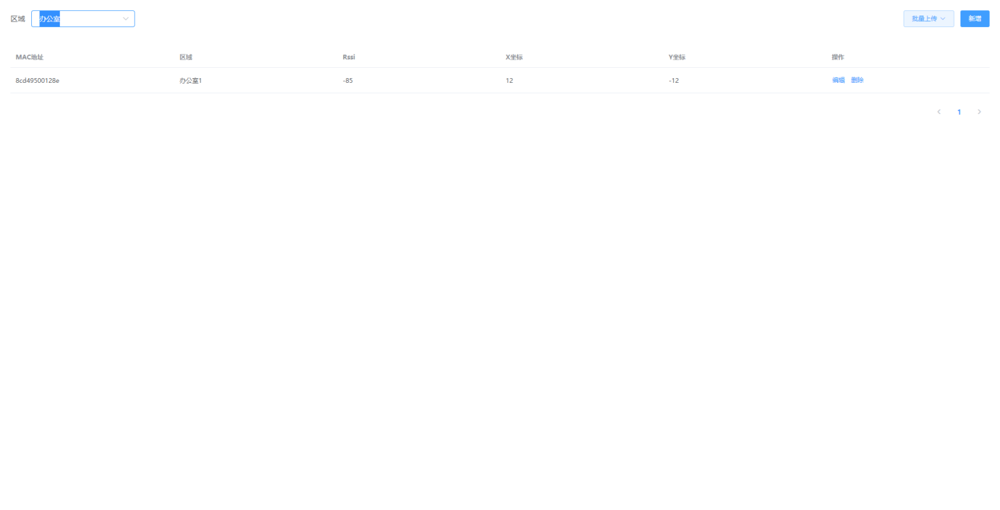

### 4.2.Z网关管理2

​	主要用于标记和查看Z网关所在区域位置，方便用户直接标记Z网关定位以及获取Z网关的坐标。

`URL:${http://ip:port}/imyfit_gateway_z2`

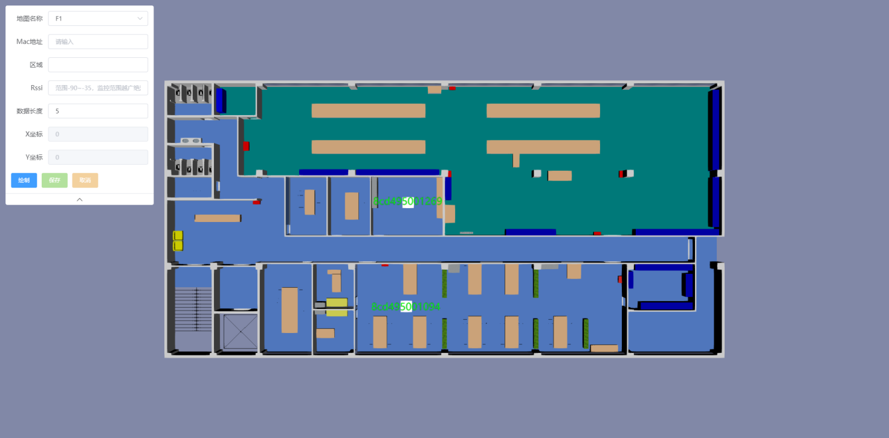

### 4.3.G网关管理界面

​	用于管理G类型网关的信息，如果使用了G类型的网关做定位信息则使用，如果没有则抛弃不使用改界面。

`URL:${http://ip:port}/imyfit_gateway_g`


### 4.4.W网关管理界面

​	用于管理W网关的信息，如果使用了W网关作为定位信息则使用，如果没有则抛弃不调用该界面。

`URL:${http://ip:port}/imyfit_gateway_w`

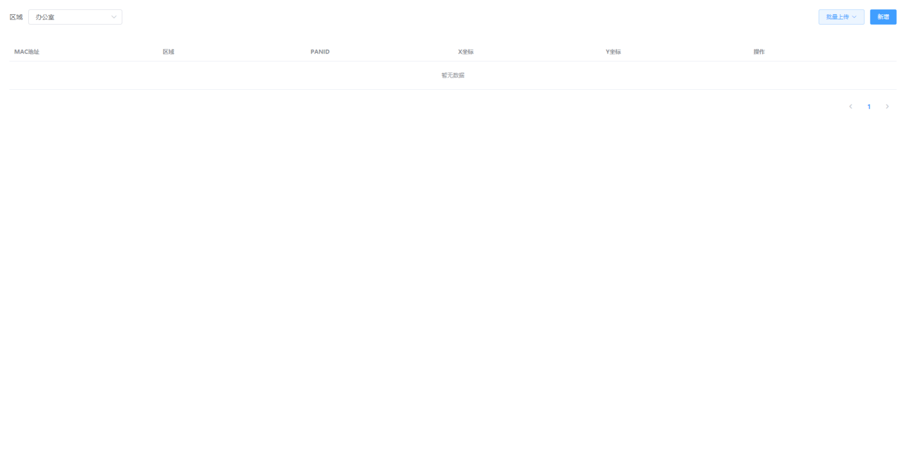

### 4.5.终端和人员关系查询界面

​	用来展示，从客户页面端传输过来人员和终端的关系的查询界面，主要作用是用来确定数据已经传输过来了。

`URL:${http://ip:port}/imyfit_worker`


### 4.6.地图管理界面

​	用于上传地图，多个地图自己做切换，排序的作用使用，显示楼层的，值越小越在上层。

`URL:${http://ip:port}/imyfit_kmzmanager`

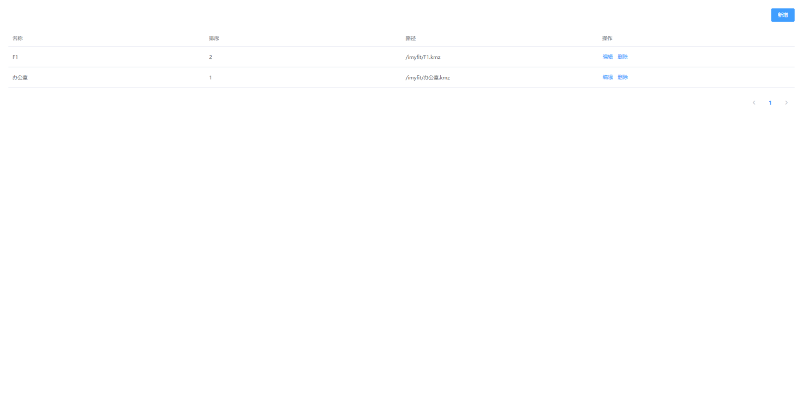

### 4.7.地图图标管理界面

​	图标管理界面，是用来在地图上显示房间号或者是某个名称标识。

`URL:${http://ip:port}/imyfit_maptag`

#### 4.7.1.添加标签

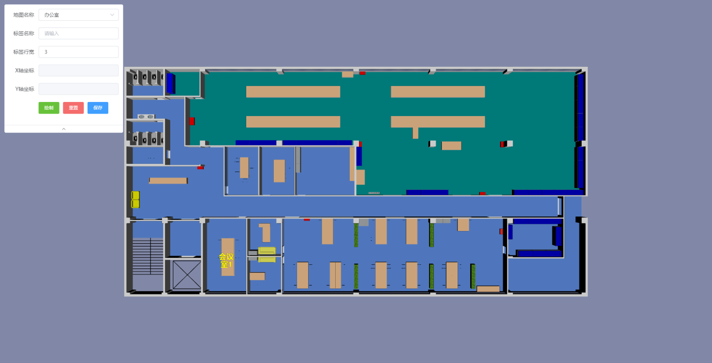

#### 4.7.2.标签管理

`URL:${http://ip:port}/imyfit_maptaglist`


### 4.8.地图配置界面

​	配置地图相关信息。

`URL:${http://ip:port}****/imyfit_mapsetting`


### 4.9.围栏管理界面(3DKMZ)

​	用于管理围栏，作为划定围栏，用于判断是否是出界，入界，滞留等相关告警

#### 4.9.1.添加围栏

`URL:${http://ip:port}/imyfit_fence`

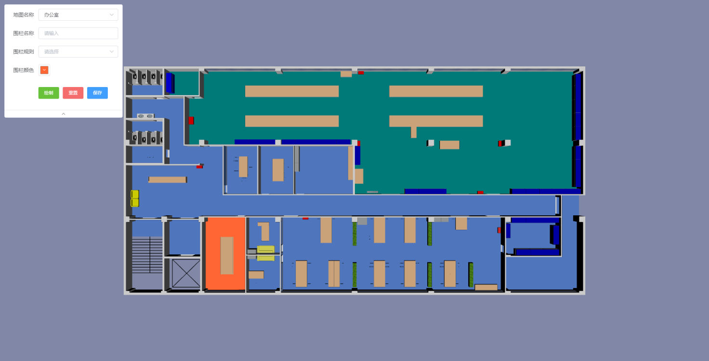

#### 4.9.2.管理围栏

`URL:${http://ip:port}/imyfit_fence_rule`

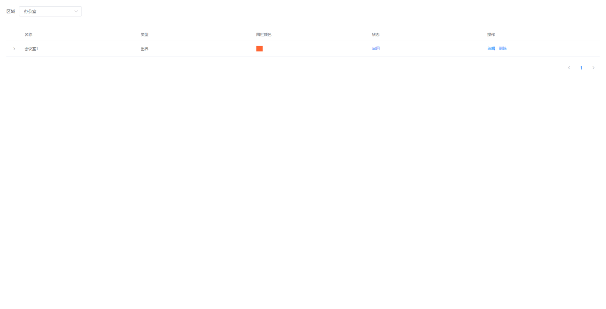

### 4.10.平面电子围栏(PNG)

​	用于管理围栏，作为划定围栏，用于判断是否是出界，入界，滞留等相关告警

#### 4.10.1添加围栏

`URL:${http://ip:port}/imyfit_fence_plane`

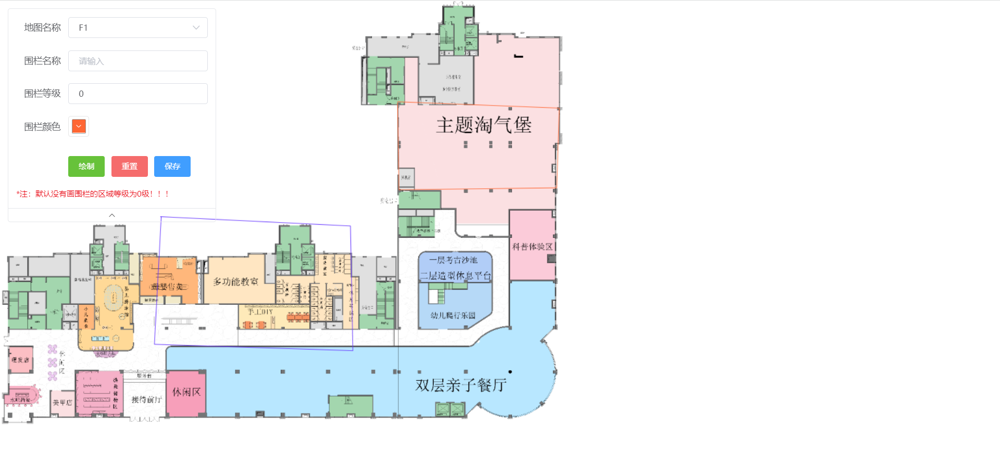

#### 4.10.2.电子围栏管理

`URL:${http://ip:port}/imyfit_fence_rule_plane`

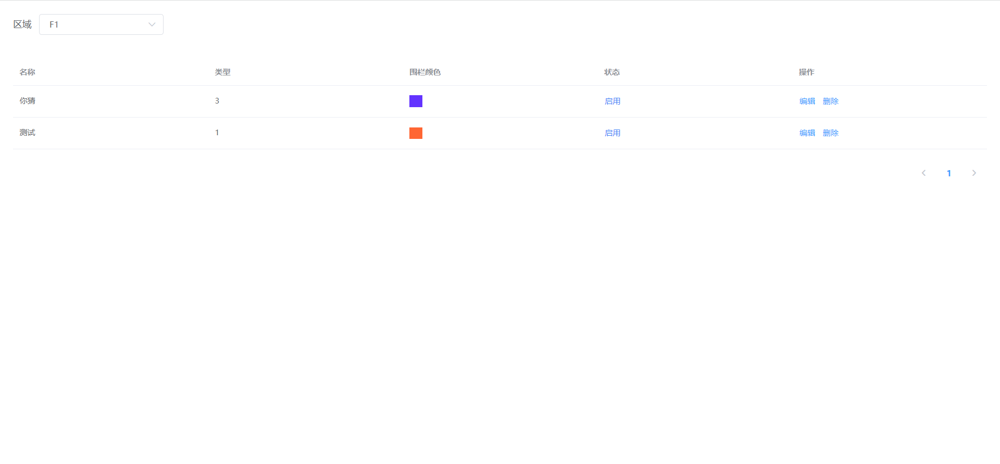

### 4.11.实时定位

​	用于实时定位展示，该定位界面，可以配合客户，放置到任一界面配合业务使用，做定位展示效果。

`URL:${http://ip:port}/imyfit_realtime`

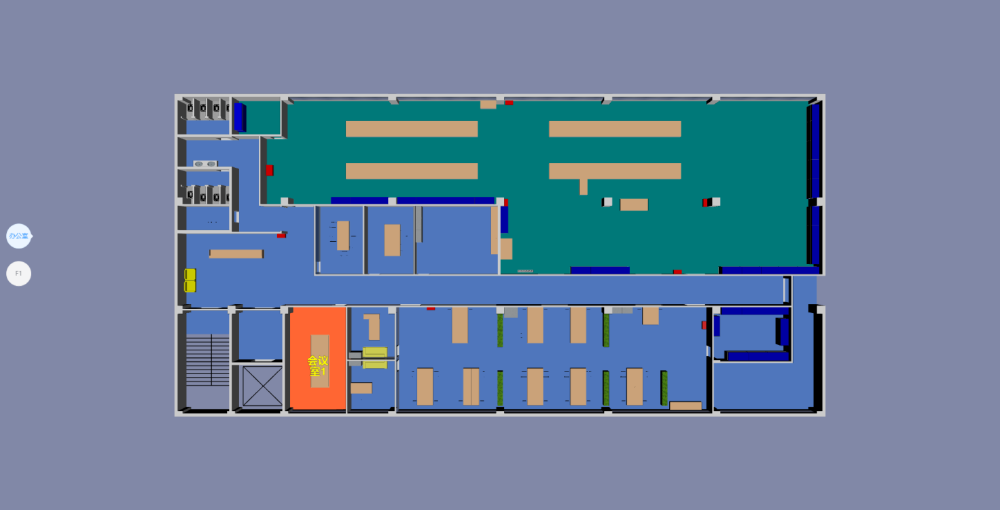

### 4.12.是内定位(PNG)

`URL:${http://ip:port}/imyfit_realtime_plane`

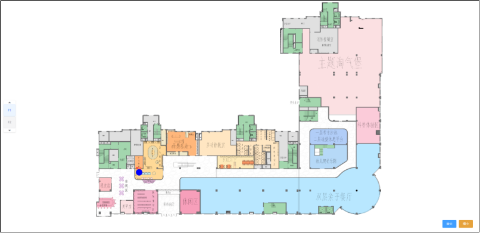

### 4.13.室外定位

​	用于客户使用了NB数据，需要室外定位的时候展示使用，如果不做室外定位即可不调用。

`URL:${http://ip:port}/imyfit_outdoor`

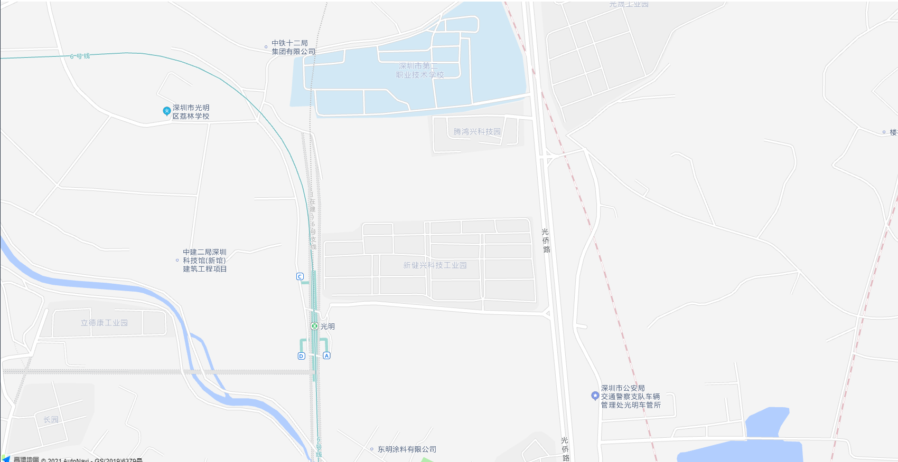

### 4.14.历史轨迹查询

`URL:${http://ip:port}/imyfit_trackline?personId=${传入用户的唯一id}`

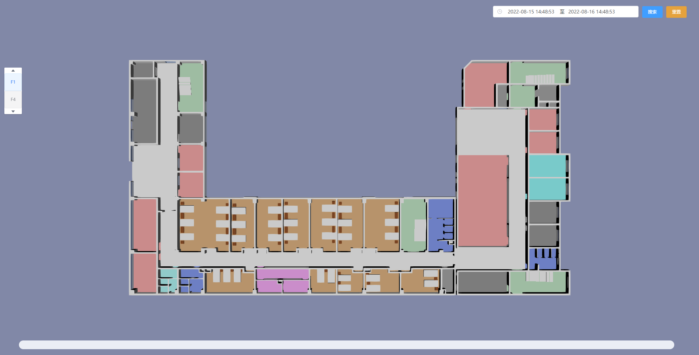

### 4.15.个人实时定位数据

`URL:${http://ip:port}/imyfit_realtime_mac?mac=${手环mac地址}`

### 4.16.声光报警器的管理

`URL:${http://ip:port}/imyfit_alarm`

### 4.17.室内室温监测

`URL:${http://ip:port}/imyfit_temperature`

### 4.18.物质标签管理

`URL:${http://ip:port}/imyfit_temperature`

## 5.TCP数据传输

​	Socket用于数据传输，用于作为客户端，建立tcp协议传输数据信息，包括定位数据，体征数据，以及一些必要的告警数据等。

​	数据传输格式都是以`@#@@@`开头和`@*@@@`结尾的，中间夹杂着相关的json数据。

如： 

```json
@#@@@"{
	"indoor": {
		"battery": 58,
		"createTime": "2021-07-20T10:54:40.566",
		"diastolic": 0,
		"gatewayMac": "8cd49500128e",
		"heartRate": 0,
		"hrv": 0,
		"locationTime": "2021-07-20  18:54:39",
		"move": "关闭",
		"restingHeartRate": 65,
		"rssi": 40,
		"sleep": "清醒",
		"sos": "关闭呼救",
		"spo2": 0,
		"status": "静",
		"step": 0,
		"systolic": 0,
		"terminalMac": "f07a8f0db21a",
		"terminalType": "B10C",
		"wear": "未佩戴",
		"x": 0.1764766424894333,
		"y": 0.010889263823628426
	}
}"@*@@@  
```

### 5.1.室内定位数据

主要传输不同类型终端设备的室内定位以及健康数据传输；

标识是：`indoor`

不同类型的传输的消息，JSON字符串，如下：

#### 5.1.1.B10C

传输的信息 

```json
 @#@@@"{
	"indoor": {
		"battery": 58,
		"createTime": "2021-07-20T10:54:40.566",
		"diastolic": 0,
		"gatewayMac": "8cd49500128e",
		"heartRate": 0,
		"hrv": 0,
		"locationTime": "2021-07-20  18:54:39",
		"move": "关闭",
		"restingHeartRate": 65,
		"rssi": 40,
		"sleep": "清醒",
		"sos": "关闭呼救",
		"spo2": 0,
		"status": "静",
		"step": 0,
		"systolic": 0,
		"terminalMac": "f07a8f0db21a",
		"terminalType": "B10C",
		"wear": "未佩戴",
		"x": 0.1764766424894333,
		"y": 0.010889263823628426
	}
}"@*@@@  
```

字段解析：

| 字段名称         | 字段含义                | 备注                                                   |
| ---------------- | ----------------------- | ------------------------------------------------------ |
| battery          | 电池电量                | 可用于判断电池电量是否过低触发低电量告警               |
| createTime       | 数据从解析中心发送时间  |                                                        |
| localtionTime    | 终端设备的时间          |                                                        |
| gatewayMac       | 终端所在区域网关mac地址 | 如果，有网关需要作为告警网关，可用于业务做区域告警处理 |
| heartrate        | 心率                    |                                                        |
| hrv              | hrv值                   |                                                        |
| move             | 是否开启运动            |                                                        |
| restingHeartRate | 静止心率                |                                                        |
| sleep            | 睡眠状态                | 分为：清醒，深睡，浅睡                                 |
| sos              | 是否开启sos告警         | 分为：开启呼救，关闭呼救                               |
| spo2             | 血氧                    |                                                        |
| status           | 动静状态                | 分为：动，静                                           |
| step             | 步数                    |                                                        |
| systolic         | 收缩压                  |                                                        |
| diastolic        | 舒张压                  |                                                        |
| wear             | 是否佩戴                | 分为：佩戴，未佩戴                                     |
| x                | 室内定位x坐标           |                                                        |
| y                | 室内定位y坐标           |                                                        |
| rssi             | 蓝牙网关的rssi值        |                                                        |
| terminalMac      | 终端mac地址             |                                                        |
| terminalType     | 终端类型                |                                                        |
| temperature      | 温度                    | 佩戴时：体温，未佩戴时：环境温度                       |

#### 5.1.2.B10

传输的信息  

```json
@#@@@"{
	"indoor": {
		"battery": 58,
		"createTime": "2021-07-20T10:54:40.566",
		"diastolic": 0,
		"gatewayMac": "8cd49500128e",
		"heartRate": 0,
		"hrv": 0,
		"locationTime": "2021-07-20  18:54:39",
		"move": "关闭",
		"restingHeartRate": 65,
		"rssi": 40,
		"fall": "跌倒",
		"sleep": "清醒",
		"sos": "关闭呼救",
		"spo2": 0,
		"status": "静",
		"step": 0,
		"systolic": 0,
		"terminalMac": "f07a8f0db21a",
		"terminalType": "B10",
		"wear": "未佩戴",
		"temperature": 36.5,
		"x": 0.1764766424894333,
		"y": 0.010889263823628426
	}
}"@*@@@  
```

字段解析：

| 字段名称         | 字段含义                | 备注                                                   |
| ---------------- | ----------------------- | ------------------------------------------------------ |
| battery          | 电池电量                | 可用于判断电池电量是否过低触发低电量告警               |
| createTime       | 数据从解析中心发送时间  |                                                        |
| localtionTime    | 终端设备的时间          |                                                        |
| gatewayMac       | 终端所在区域网关mac地址 | 如果，有网关需要作为告警网关，可用于业务做区域告警处理 |
| heartrate        | 心率                    |                                                        |
| hrv              | hrv值                   |                                                        |
| move             | 是否开启运动            |                                                        |
| restingHeartRate | 静止心率                |                                                        |
| sleep            | 睡眠状态                | 分为：清醒，深睡，浅睡                                 |
| fall             | 跌倒状态                | 分为：跌倒，正常                                       |
| sos              | 是否开启sos告警         |                                                        |
| spo2             | 血氧                    |                                                        |
| status           | 动静状态                | 分为：动，静                                           |
| step             | 步数                    |                                                        |
| systolic         | 收缩压                  |                                                        |
| diastolic        | 舒张压                  |                                                        |
| wear             | 是否佩戴                | 分为：佩戴，未佩戴                                     |
| x                | 室内定位x坐标           |                                                        |
| y                | 室内定位y坐标           |                                                        |
| rssi             | 蓝牙网关的rssi值        |                                                        |
| terminalMac      | 终端mac地址             |                                                        |
| terminalType     | 终端类型                |                                                        |
| temperature      | 温度                    | 佩戴时：体温，未佩戴时：环境温度                       |

#### 5.1.3.R9、R9C

注：R9支持UWB室内定位所以，存在蓝牙网关和UWB网关两种，主要是通过gatewayMac判断是蓝牙区域，paind判断是UWB区域

传输的信息 

```json
@#@@@"{
	"indoor": {
		"battery": 58,
		"createTime": "2021-07-20 10:54:40",
		"diastolic": 0,
		"gatewayMac": "8cd49500128e",
		"heartRate": 0,
		"locationTime": "2021-07-20  18:54:39",
		"silent": "false",
		"band": "off",
		"rssi": 40,
		"sleep": "清醒",
		"sos": "off",
		"spo2": 0,
		"step": 0,
		"systolic": 0,
		"terminalMac": "f07a8f0db21a",
		"terminalType": "R9",
		"wear": "佩戴",
		"x": 0.1764766424894333,
		"y": 0.010889263823628426,
		"temperatureEnvn": 33.4,
		"temperatureSkin": 35.6,
		"temperatureCore": 36.5,
        "charge":"充电中",
        "chargeIntoStatus":"充电器插入",
	}
}"@*@@@  
```

字段解析：

| 字段名称         | 字段含义                | 备注                                                         |
| ---------------- | ----------------------- | ------------------------------------------------------------ |
| battery          | 电池电量                | 可用于判断电池电量是否过低触发低电量告警                     |
| createTime       | 数据从解析中心发送时间  |                                                              |
| localtionTime    | 终端设备的时间          |                                                              |
| gatewayMac       | 终端所在区域网关mac地址 | 如果，有网关需要作为告警网关，可用于业务做区域告警处理，如果该key有值表明实在蓝牙网关定位 |
| heartRate        | 心率                    |                                                              |
| slient           | 是否是静止状态          | 分为：true，false                                            |
| band             | 是否断带                | 分为：on，off                                                |
| sleep            | 睡眠数据                | 总睡时长#深睡时长#浅睡时长                                   |
| sos              | 是否开启sos告警         | 分为：on，off                                                |
| spo2             | 血氧                    |                                                              |
| step             | 步数                    |                                                              |
| systolic         | 收缩压                  |                                                              |
| diastolic        | 舒张压                  |                                                              |
| wear             | 是否佩戴                | 佩戴，未佩戴                                                 |
| temperatureEnvn  | 环境温度                |                                                              |
| temperatureSkin  | 体表温度                |                                                              |
| temperatureCore  | 人体真实温度            |                                                              |
| x                | 室内定位x坐标           |                                                              |
| y                | 室内定位y坐标           |                                                              |
| rssi             | 网关的rssi值            |                                                              |
| terminalMac      | 终端mac地址             |                                                              |
| terminalType     | 终端类型                |                                                              |
| charge           | 充电状态                | 充电中、未充电                                               |
| chargeIntoStatus | 充电器                  | 充电器插入、充电器未插入                                     |

#### 5.1.4.X3W

传输的信息

```json
@#@@@"{
	"indoor": {
		"battery": 58,
		"createTime": "2021-07-20T10:54:40.566",
		"sportMode": "开",
		"gatewayMac": "8cd49500128e",
		"heartRate": 0,
		"locationTime": "2021-07-20 18:54:39",
		"rssi": 40,
		"sleep": "清醒",
		"step": 0,
		"status": "动",
		"terminalMac": "f07a8f0db21a",
		"terminalType": "X3W",
		"wear": "未佩戴",
		"x": 0.1764766424894333,
		"y": 0.010889263823628426,
		"temperatureEnvn": 33.4,
		"temperatureSkin": 35.6,
		"temperatureCore": 36.5
	}
}"@*@@@  
```

字段解析：

| 字段名称        | 字段含义                | 备注                                                   |
| --------------- | ----------------------- | ------------------------------------------------------ |
| battery         | 电池电量                | 可用于判断电池电量是否过低触发低电量告警               |
| createTime      | 数据从解析中心发送时间  |                                                        |
| localtionTime   | 终端设备的时间          |                                                        |
| gatewayMac      | 终端所在区域网关mac地址 | 如果，有网关需要作为告警网关，可用于业务做区域告警处理 |
| heartrate       | 心率                    |                                                        |
| status          | 动静状态                | 分为：动，静                                           |
| sportMode       | 运动模式                | 分为：开启，关闭                                       |
| wear            | 佩戴状态                | 分为：佩戴，未佩戴                                     |
| sleep           | 睡眠数据                | 分为：清醒，深睡，浅睡                                 |
| step            | 步数                    |                                                        |
| temperatureEnvn | 环境温度                |                                                        |
| temperatureSkin | 体表温度                |                                                        |
| temperatureCore | 人体真实温度            |                                                        |
| x               | 室内定位x坐标           |                                                        |
| y               | 室内定位y坐标           |                                                        |
| rssi            | 网关的rssi值            |                                                        |
| terminalMac     | 终端mac地址             |                                                        |
| terminalType    | 终端类型                |                                                        |

#### 5.1.5.C5S

传输的信息

```json
@#@@@"{
	"indoor": {
		"battery": 58,
		"createTime": "2021-07-20T10:54:40.566",
		"sportMode": "开",
		"gatewayMac": "8cd49500128e",
		"heartRate": 0,
		"locationTime": "2021-07-20 18:54:39",
		"rssi": 40,
		"sleep": "清醒",
		"step": 0,
		"status": "动",
		"terminalMac": "f07a8f0db21a",
		"terminalType": "C5S",
		"wear": "未佩戴",
		"x": 0.1764766424894333,
		"y": 0.010889263823628426,
		"temperatureEnvn": 33.4,
		"temperatureSkin": 35.6,
		"temperatureCore": 36.5,
		"diastolic": 0,
		"systolic": 0,
		"spo2": 0,
		"hrv": 0
	}
}"@*@@@
```

字段解析：

| 字段名称        | 字段含义                | 备注                                                   |
| --------------- | ----------------------- | ------------------------------------------------------ |
| battery         | 电池电量                | 可用于判断电池电量是否过低触发低电量告警               |
| createTime      | 数据从解析中心发送时间  |                                                        |
| localtionTime   | 终端设备的时间          |                                                        |
| gatewayMac      | 终端所在区域网关mac地址 | 如果，有网关需要作为告警网关，可用于业务做区域告警处理 |
| heartrate       | 心率                    |                                                        |
| status          | 动静状态                | 分为：动，静                                           |
| sportMode       | 运动模式                | 分为：开启，关闭                                       |
| wear            | 佩戴状态                | 分为：佩戴，未佩戴                                     |
| sleep           | 睡眠数据                | 分为：清醒，深睡，浅睡                                 |
| step            | 步数                    |                                                        |
| systolic        | 收缩压                  |                                                        |
| diastolic       | 舒张压                  |                                                        |
| spo2            | 血氧                    |                                                        |
| hrv             | hrv值                   |                                                        |
| temperatureCore | 人体真实温度            |                                                        |
| x               | 室内定位x坐标           |                                                        |
| y               | 室内定位y坐标           |                                                        |
| rssi            | 网关的rssi值            |                                                        |
| terminalMac     | 终端mac地址             |                                                        |
| terminalType    | 终端类型                |                                                        |

### 5.2.NB数据

主要涉及有室外定位数据以及体征数据。

#### 5.2.1.B10、B10C、R9C

##### 5.2.1.1.outdoor

传输的数据信息

```json
@#@@@"{
	"outdoor": {
		"battery": 58,
		"createTime": "2021-07-20T10:54:40.566",
		"heartRate": 0,
		"locationTime": "2021-07-20T18:54:39",
		"rssi": 40,
		"snr": 0,
		"step": 0,
		"csq": 0,
		"terminalMac": "f07a8f0db21a",
		"terminalType": "B10",
		"isWear": "yes",
		"lat": 0.1764766424894333,
		"lon": 0.010889263823628426,
		"temperatureEnvn": 33.4,
		"temperatureCore": 36.5,
		"diastolic": 0,
		"systolic": 0,
		"spo2": 0,
		"pressure": 0
	}
}"@*@@@
```

字段解析：

| 字段名称        | 字段含义               | 备注                                     |
| --------------- | ---------------------- | ---------------------------------------- |
| battery         | 电池电量               | 可用于判断电池电量是否过低触发低电量告警 |
| createTime      | 数据从解析中心发送时间 |                                          |
| localtionTime   | 终端设备的时间         |                                          |
| spo2            | 血氧                   |                                          |
| heartrate       | 心率                   |                                          |
| status          | 动静状态               | 分为：动，静                             |
| sportMode       | 运动模式               | 分为：开启，关闭                         |
| isWear          | 佩戴状态               | 分为：yes，no                            |
| step            | 步数                   |                                          |
| temperatureEnvn | 环境温度               |                                          |
| temperatureCore | 人体真实温度           |                                          |
| lat             | 纬度                   | 坐标适配高德地图                         |
| lon             | 经度                   | 坐标适配高德地图                         |
| systolic        | 收缩压                 |                                          |
| diastolic       | 舒张压                 |                                          |
| pressure        | 气压值                 |                                          |
| terminalMac     | 终端mac地址            |                                          |
| terminalType    | 终端类型               |                                          |

##### 5.2.1.2.离线心率

传输的信息

```json
@#@@@"{
	"heartOffline": {
		"heartOfflineData": "0,0,0,0,0,0,0,0,0,0,0,0,0,0,0,0,0,0,0,0,0,0,0,0,0,0,0,0,0,0,0,0,0,0,0,0,0,0,0,0,0,0,0,0,0,0,0,0,0,0,0,0,0,0,0,0,0,0,0,0",
		"count": 60,
		"pack": 187,
		"interval": 5,
		"date": "20210108",
		"terminalMac": "e990c0fc3e3f",
		"terminalType": "B10",
		"createTime": "2021-07-20T10:54:40.566"
	}
}"@*@@@  
```

字段解析

| 字段名称         | 字段含义           | 备注                             |
| ---------------- | ------------------ | -------------------------------- |
| heartOfflineData | 上报的心率数据     | 当数据全部为0x00或者0xff则不上报 |
| count            | 上报的心率个数     | 固定60                           |
| pack             | 心率包的序号       | 1-288                            |
| interval         | 心率数据的间隔时间 | 固定：5秒                        |
| date             | 年月日             |                                  |
| termianlMac      | 终端mac地址        |                                  |
| terminalType     | 终端类型           |                                  |
| createTime       | 传输时间           |                                  |

##### 5.2.1.3. 睡眠离线数据

每天十点开始传输睡眠数据

传输信息

```json
@#@@@{
	"sleep": {
		"sleep": "0,0,0,0,0,0,0,0,0,0,0,0,0,0,0,0,0,0,0,0,0,0,0,0,0,0,0,0,0,2,3,1,0,0,0,0,0,0,0,0,0,0,0,0,0,0,0,0,0,0,0,0,0,0,0,0,0,0,0,0",
		"sleepType": 1,
		"terminalType": "B10",
		"sleepDate": "20210108",
		"terminalMac": "e990c0fc3e3f",
		"createTime": "2021-07-20T10:54:40.566"
	}
}@#@@@
```

字段解析

| 字段名称     | 字段含义                                     | 备注           |
| ------------ | -------------------------------------------- | -------------- |
| sleep        | 睡眠数据：0:活动，1：浅度，2：深度 3：未监测 | 每十分钟一个值 |
| sleepType    | 睡眠数据类型，无任何意义                     |                |
| sleepDate    | 睡眠数据的日期                               | 20210101       |
| termianlMac  | 终端mac地址                                  |                |
| terminalType | 终端类型                                     |                |
| createTime   | 传输时间                                     |                |

#### 5.2.2.R9

##### 5.2.2.1.outdoor

传输的信息 

```json
@#@@@"{
	"outdoor": {
		"battery": 58,
		"createTime": "2021-07-20T10:54:40.566",
		"diastolic": 0,
		"heartRate": 0,
		"locationTime": "2021-07-20T18:54:39",
		"band": "off",
		"spo2": 0,
		"step": 0,
		"systolic": 0,
		"terminalMac": "f07a8f0db21a",
		"terminalType": "R9",
		"wearStatus": "1",
		"x": 0.1764766424894333,
		"y": 0.010889263823628426,
		"temperatureEnvn": 33.4,
		"temperatureSkin": 35.6,
		"temperatureCore": 36.5
	}
}"@*@@@  
```

字段解析：

| 字段名称        | 字段含义               | 备注                                     |
| --------------- | ---------------------- | ---------------------------------------- |
| battery         | 电池电量               | 可用于判断电池电量是否过低触发低电量告警 |
| createTime      | 数据从解析中心发送时间 |                                          |
| localtionTime   | 终端设备的时间         |                                          |
| heartrate       | 心率                   |                                          |
| spo2            | 血氧                   |                                          |
| step            | 步数                   |                                          |
| systolic        | 收缩压                 |                                          |
| diastolic       | 舒张压                 |                                          |
| wearStatus      | 是否佩戴               |                                          |
| temperatureEnvn | 环境温度               |                                          |
| temperatureSkin | 体表温度               |                                          |
| temperatureCore | 人体真实温度           |                                          |
| x               | 地图纬度               |                                          |
| y               | 地图经度               |                                          |
| rssi            | 网关的rssi值           |                                          |
| terminalMac     | 终端mac地址            |                                          |
| terminalType    | 终端类型               |                                          |

###  5.3.告警信息

#### 5.3.1.围栏告警

传输的信息 

```json
@#@@@"{
	"type":"fence"
	"data": {
		"name": "张三",
		"time": "2021-07-20 10:54:40",
		"fenceName": "厕所",
		"warnType": "in",
		"fenceType": "start",
		"mac": "f07a8f0db21a"
	}
}"@*@@@  
```

字段解析：

| 字段名称  | 字段含义              | 备注                                            |
| --------- | --------------------- | ----------------------------------------------- |
| type      | fence                 |                                                 |
| name      | 用户名称              |                                                 |
| time      | 告警时间              |                                                 |
| fenceName | 告警地方（围栏名称）  |                                                 |
| warnType  | 告警类型              | 分为：in（入界），out（出界），stranded（滞留） |
| fenceType | 开始还是结束          | 分为：start，end                                |
| mac       | 告警的终端设备mac地址 |                                                 |

#### 5.3.2.高心率

传输的信息

```json
@#@@@"{
	"type":"heartRate",
	"data": {
		"name": "张三",
		"time": "2021-07-20 10:54:40",
		"warnType": "highHeart",
		"data": 160,
		"mac": "f07a8f0db21a",
        "heartType":"start"
	}
}"@*@@@
```

  字段解析：

| 字段名称  | 字段含义              | 备注             |
| --------- | --------------------- | ---------------- |
| type      | heartRate             |                  |
| name      | 用户名称              |                  |
| time      | 告警时间              |                  |
| data      | 心率                  |                  |
| warnType  | highHeart             |                  |
| mac       | 告警的终端设备mac地址 |                  |
| heartType | 开始还是结束          | 分为：start，end |

#### 5.3.3.低心率

```json
@#@@@"{
	"type":"heartRate"
	"data": {
		"name": "张三",
		"time": "2021-07-20 10:54:40",
		"warnType": "lowHeart",
		"data": 40,
		"mac": "f07a8f0db21a",
        "heartType":"start"
	}
}"@*@@@
```

  字段解析：

| 字段名称  | 字段含义              | 备注             |
| --------- | --------------------- | ---------------- |
| type      | heartRate             |                  |
| name      | 用户名称              |                  |
| time      | 告警时间              |                  |
| data      | 心率                  |                  |
| warnType  | lowHeart              |                  |
| mac       | 告警的终端设备mac地址 |                  |
| heartType | 开始还是结束          | 分为：start，end |

#### 5.3.4.低电量

```json
 @#@@@"{
	"type":"battery",
	"data": {
		"name": "张三",
		"time": "2021-07-20 10:54:40",
		"warnType": "lowBattery",
		"data": 10,
		"mac": "f07a8f0db21a"
	}
}"@*@@@  
```

字段解析：

| 字段名称 | 字段含义              | 备注 |
| -------- | --------------------- | ---- |
| type     | battery               |      |
| name     | 用户名称              |      |
| time     | 告警时间              |      |
| data     | 电量值                |      |
| warnType | 告警类型              |      |
| mac      | 告警的终端设备mac地址 |      |

#### 5.3.5.逃离告警

```json
 @#@@@"{
	"type":"warn",
	"data": {
		"name": "张三",
		"space": "围墙",
		"warnType": "runOut",
        "time":"2021-07-20 10:54:40",
        "mac":"f07a8f0db21a"
	}
}"@*@@@ 
```

| 字段名称 | 字段含义              | 备注 |
| -------- | --------------------- | ---- |
| type     | warn                  |      |
| time     | 告警时间              |      |
| space    | 地点                  |      |
| warnType | 告警类型              |      |
| mac      | 告警的终端设备mac地址 |      |

#### 5.3.6.网关离线告警

```
 @#@@@"{
	"type":"off_line",
	"data": {
		"mac": "8cd495000a0f",
		"space": "围墙",
	}
}"@*@@@
```

| 字段名称 | 字段含义           | 备注 |
| -------- | ------------------ | ---- |
| type     | off_line           |      |
| mac      | 离线的网关mac地址  |      |
| space    | 离线网关所处的地方 |      |
